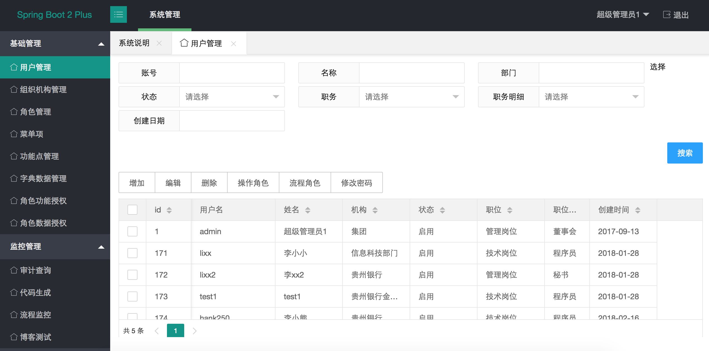
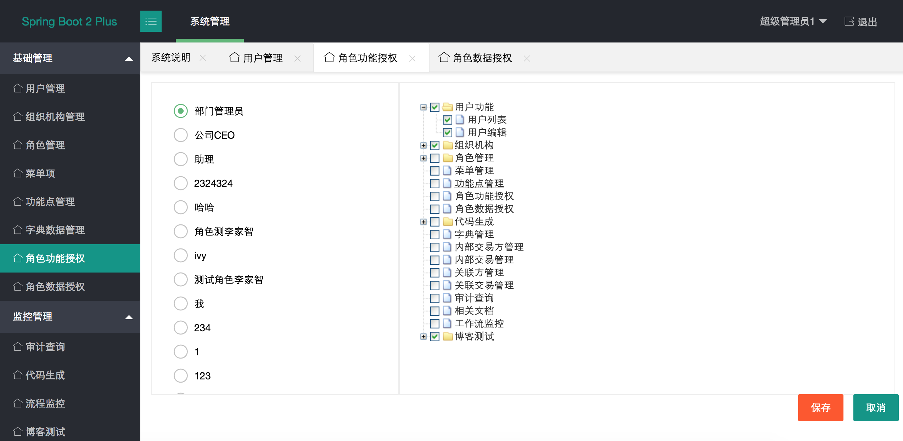
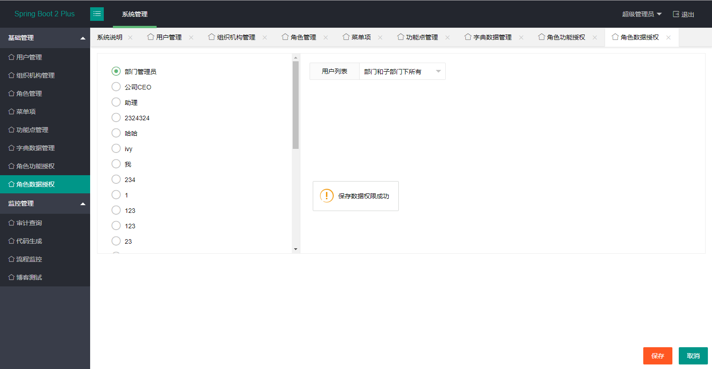
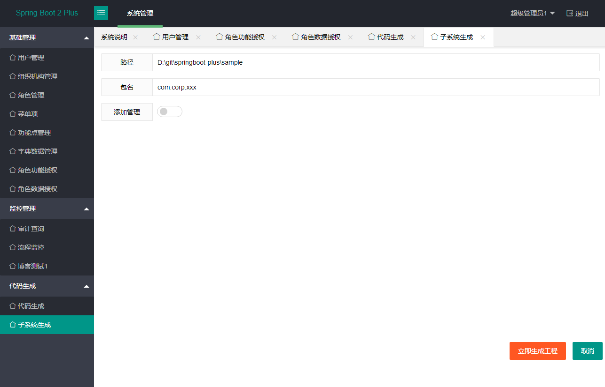
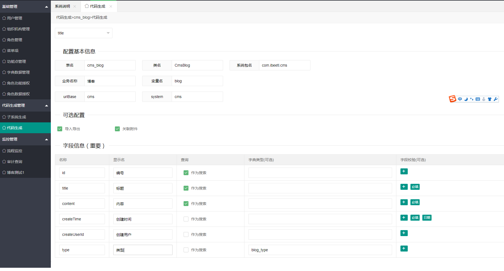
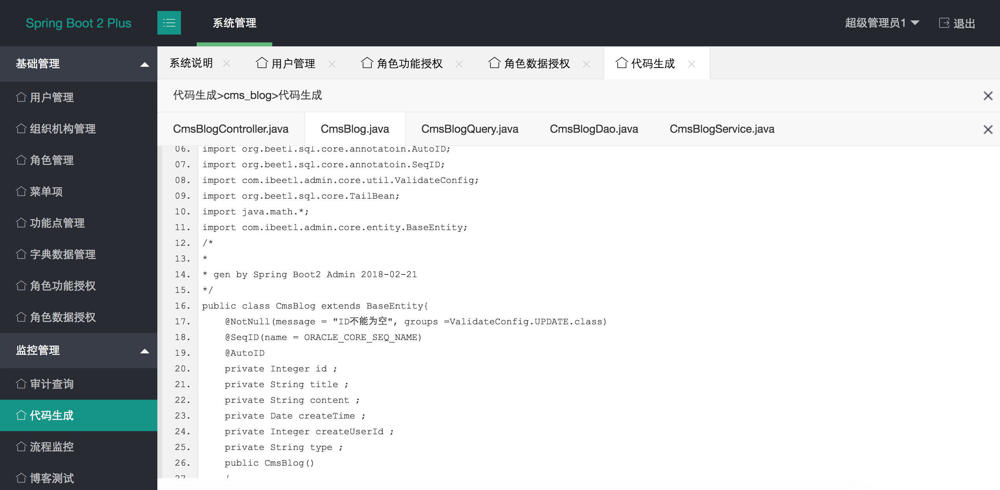
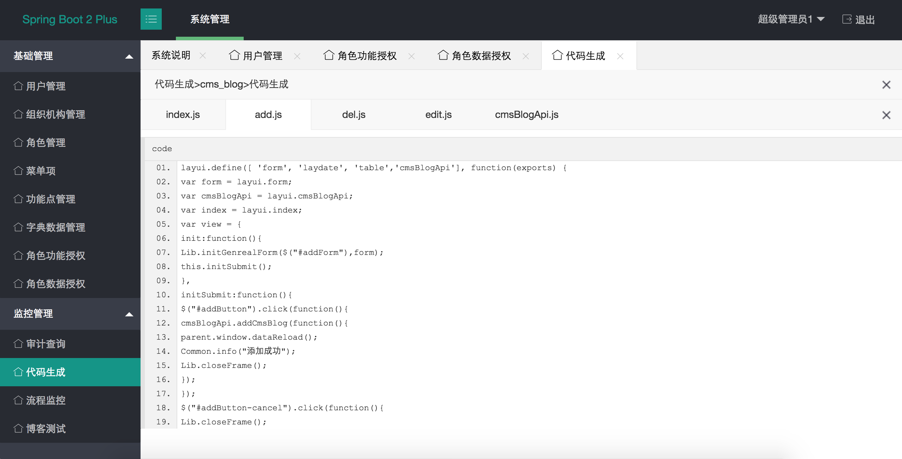
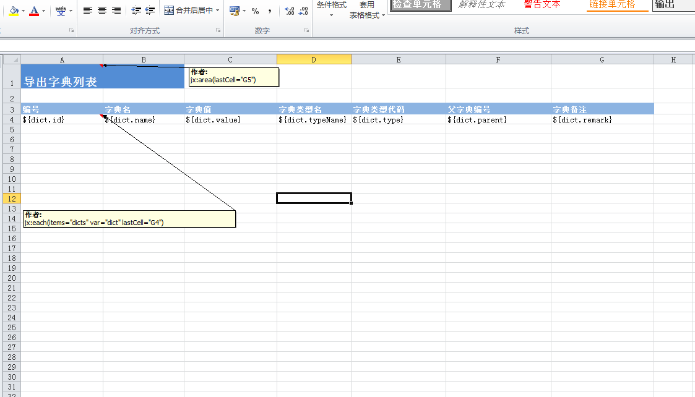
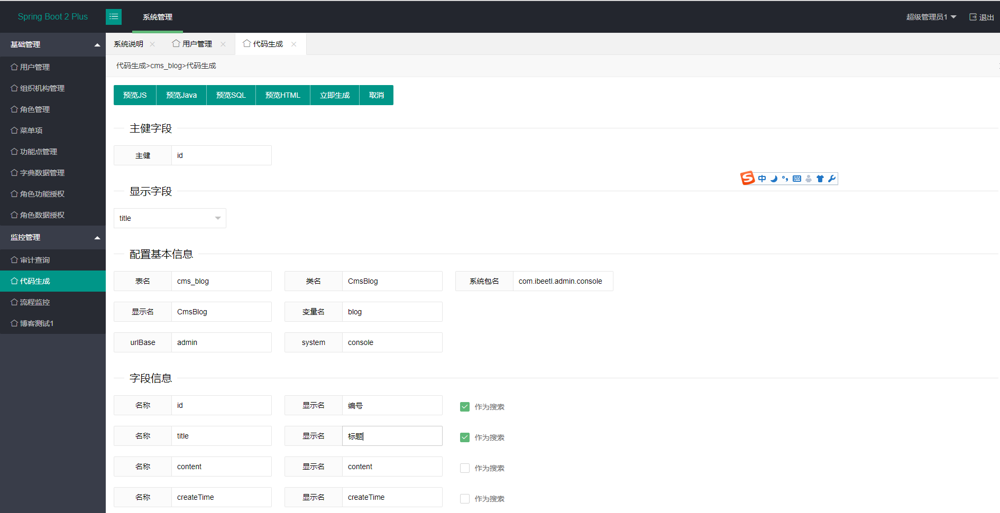

# springboot-plus
一个基于SpringBoot 2 的管理后台系统,包含了用户管理，组织机构管理，角色管理，功能点管理，菜单管理，权限分配，数据权限分配，代码生成等功能

系统基于Spring Boot2技术，前端采用了Layui2。数据库以MySQL为实例，理论上是跨数据库平台.

基本技术栈来源于我为电子工业出版社编写的的[<<Spring Boot 2 精髓 >>](http://ibeetl.com/sb2/#more) (这本书每一章也有各种例子，但Springboot-plus 更偏向于应用而不是教学)

当前版本:1.1

技术交流群：219324263

开源地址：https://gitee.com/xiandafu/springboot-plus

视频介绍：https://pan.baidu.com/s/1dFPoaT7

# 1 使用说明

## 1.1 安装说明

从Git上获取代码后，通过IDE导入此Maven工程，包含俩个子工程

* admin-core  ，核心包，包含了缓存，数据权限，公用的JS和HTML页面。
* admin-console, 系统管理功能，包含了用户，组织机构，角色，权限，数据权限，代码生成等管理功能

com.ibeetl.admin.CosonleApplication 是系统启动类，在admin-console包下,在运行这个之前，还需要初始化数据库，位于doc/starter-mysql.sql,目前只提供mysql和oracle脚本。理论上支持所有数据库

还需要修改SpringBoot配置文件application.properties,修改你的数据库地址和访问用户

~~~properties
spring.datasource.url=jdbc:mysql://127.0.0.1:3306/starter?useUnicode=true&characterEncoding=UTF-8&serverTimezone=GMT%2B8&useSSL=false
spring.datasource.username=root
spring.datasource.password=123456

~~~

> 建议在彻底熟悉plus系统之前，先暂时不要修改其他配置选项，免得系统无法访问
>
> 本系统基于Spring Boot 2 ，因此请务必使用JDK8，且打开编译选项[parameters](http://www.mamicode.com/info-detail-2162647.html),<u> 并重新编译工程，如果你没有使用Java8的 parameters 特性，系统不能正常使用</u>

运行CosonleApplication，然后访问http://127.0.0.1:8080/  输入admin/123456 则可以直接登录进入管理系统

如果成功启动后运行报错：变量userId未定义，位于第6行，那是因为你没有启用[parameters](http://www.mamicode.com/info-detail-2162647.html)

## 1.2 创建子系统

SpringBoot-plus 是一个适合大系统拆分成小系统的架构，或者是一个微服务系统，因此，如果你需要创建自己的业务系统，比如，一个CMS子系统，建议你不要在SpringBoot-Plus 添加代码，应该是新建立一个maven工程，依赖admin-core，或者依赖admin-console（如果你有后台管理需求，通常都有，但不是必须的）

创建子系统，可以进入代码生成>子系统生成， 输入maven项目路径，还有包名，就可以直接生成一个可运行的基于SpringBoot-Plus 的子系统

### 1.2.1 配置子系统

###  1.2.2 添加代码

## 1.3 业务代码生成

在介绍如何利用Plus开发系统之前，先介绍代码生成功能，此功能可以生成前后端代码总计14个文件，你可以通过预览功能了解如何开发这个系统

代码生成针对表进行代码生成，包括JS，JAVA，SQL和HTML，可以通过预览功能直接预览。在生成代码到本地前，有写参数需要修改，否则，代码生成后显示的都是英文

* 显示字段 ： 当此实体显示在任何地方的时候，能代表此实体的名称，比如用户名，组织机构名
* 变量名：可以自己设定一个较短的名字，此变量名会用于前后端的变量
* urlBase：你规划的子系统，最后访问路径是urlBase+变量名字
* system: 存放sql目录的的名称

其他修改的地方有

字段信息的显示名字，这个用于前端列表，表单的显示，应当输入中文名字

作为搜索，可以勾选几个搜索条件，系统自动生成一个搜索配置类

### 1.3.1 前端代码

前端代码采用了layui的JS框架，使用了按需加载的方式，文档参考 http://www.layui.com/doc/base/infrastructure.html.

* index.js: 系统入口JS，包含了查询和表格
* add.js : 新增操作的所有JS
* edit.js: 编辑操作的所有JS
* del.js: 删除操作的所有JS

基础JS

* Common.js: 封装了通常JS功能，如jquery的post方法，layui的窗口方法
* Lib.js  封装了业务相关方法，如submitForm，loadOrgPanel等方法

### 1.3.2  HTML代码

页面采用layui，文档参考 http://www.layui.com/demo/

模板语言了使用Beetl，文档参考ibeetl.com

* index.html: 功能首页

* add.html: 新增首页

* edit.html: 编辑操作首页

  ​

基础UI组件：

* orgInput.tag.html 组织机构输入框
* simpleDictSelect.tag.html 字典下拉列表
* childrenDictSelect.tag.html 级联字典下拉列表
* searchForm.tag.html  通用搜索表单
* submitButtons.tag.html 提交按钮
* accessButton.tag.html  普通按钮（含权限）
* ....

# zdxh
